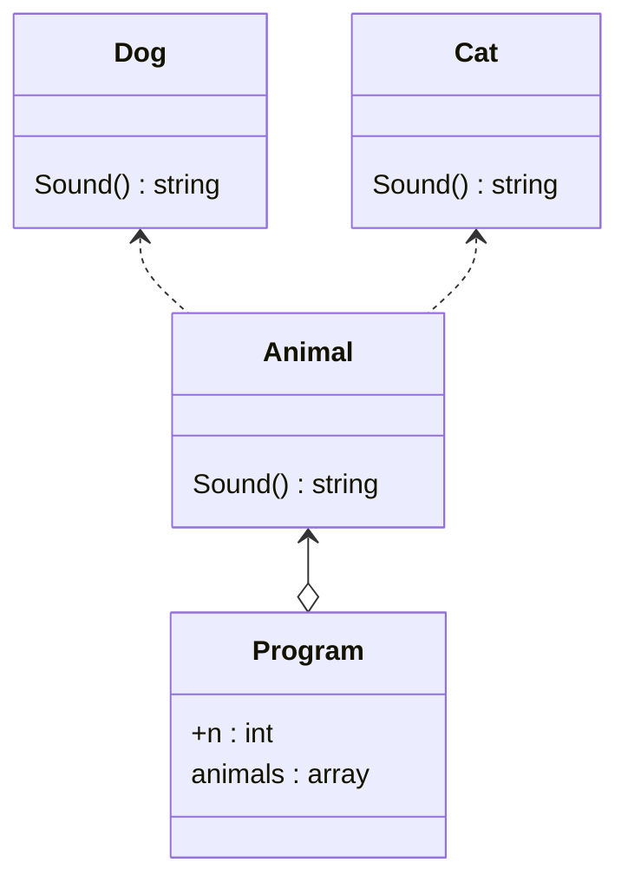

## Mermaid Diagram

```mermaid
classDiagram

class Program{
    +n : int
    animals : array

}
Animal <--o Program

class Animal{
    
    Sound() string
}
Dog <.. Animal

class Dog{
    
    Sound() string
}
Cat <.. Animal

class Cat{
    
    Sound() string
}
    


```